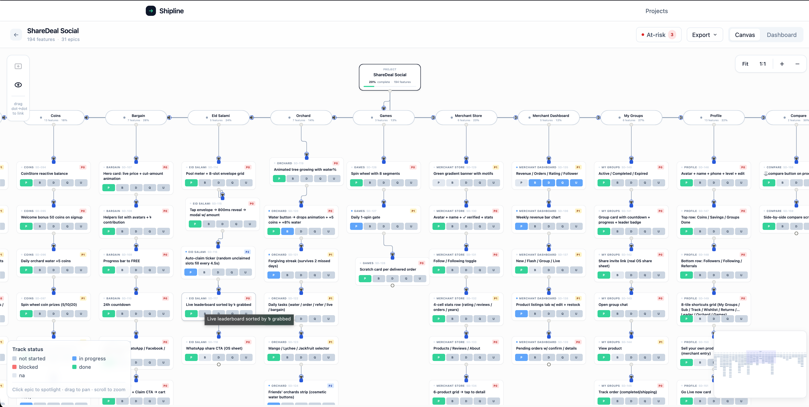

<div align="center">

# Shipline

**See every feature you're shipping — and what's blocking it — in one picture.**

Cross-functional feature-readiness tracker for founders and CTOs. Upload an Excel sheet, get a live, draggable flow board with Prototype · Backend · Dev · QA · UI/UX status on every feature.

[](https://angular.dev/)
[](https://nestjs.com/)
[](https://prisma.io/)
[](https://www.postgresql.org/)
[](https://flow.foblex.com/)

</div>

---

## Why Shipline exists

Today, "is feature X shippable?" lives in your head:

| Tool        | Tracks            | Misses                    |
|-------------|-------------------|---------------------------|
| Linear/Jira | Dev               | Design · marketing · QA   |
| Figma       | Design            | Everything else           |
| Notion doc  | Whatever you type | Updates · structure       |
| **Excel**   | Everything…       | …and nothing in real time |

You assemble the picture every Monday morning. Shipline makes it visible all the time.

```
                       ┌─────────────────┐
                       │  ShareDeal Soc. │      ← Project root
                       └────────┬────────┘
            ┌────────┬────────┬─┴──────┬────────┬─ ... 30 epics
       (Onboarding)(Auth)  (Home)   (Cart)  (Coins)
            │       │       │          │       │
            ▼       ▼       ▼          ▼       ▼
         Feature  Feature ...        Feature ...
            │       │                  │
            ▼       ▼                  ▼
         Feature  Feature           Feature
            │
            ▼
         Feature                            Each card shows a status
         ▔▔▔▔▔ ▔▔▔ ▔▔ ▔ ▔                   strip: Prototype · Backend ·
                                            Dev · QA · UI/UX
```

---

## Screenshots

> _Drop your captures into `docs/screenshots/` and they'll appear here._

| | |
| --- | --- |
| **Homepage** — premium landing with project cards |  |
| **Canvas** — full feature tree with status strips |  |
| **Spotlight** — click an epic, the rest dims |  |
| **Detail panel** — all 22 Excel columns + 5 track statuses |  |
| **Dashboard** — per-epic readiness rollup |  |

---

## Quick Start

**Requirements:** Node 22+, npm 11+, Docker Desktop, ~1 GB RAM.

```bash
git clone https://github.com/arafatomer66/shipline
cd shipline

# 1. Postgres on port 5438
docker compose up -d postgres

# 2. API (port 3001)
cd api
npm install
cp .env.example .env
npx prisma migrate dev          # creates schema, seeds none
npm run dev

# 3. Web (port 4300)  — in another terminal
cd ../web
npm install
npm run dev
```

Open <http://localhost:4300> → click **New Project** or **Import Excel**.

### Import your existing tracker (the killer move)

```bash
curl -X POST \
  -F "file=@your-feature-tracker.xlsx" \
  -F "projectName=My Product" \
  http://localhost:3001/api/import/excel
```

The importer accepts the 22-column layout below and auto-lays out the canvas as a tree (Project → Epics → vertical feature chains). With the bundled ShareDeal tracker as a reference, **192 features × 30 epics imports in one call**.

| Column            | Used for                                      |
|-------------------|-----------------------------------------------|
| ID                | `externalId` on the feature                   |
| Epic              | groups features into vertical columns         |
| Sub-area, Feature, Description, User role, Trigger, Screen / file, UI element type, Acceptance criteria, Notes | Free-text fields on the detail panel          |
| Prototype state   | seeds the **Prototype** track status          |
| Backend needed    | seeds the **Backend** track status (`NO`→N/A) |
| API endpoint hint | Mono-font field for engineers                 |
| Priority          | P0/P1/P2/P3 badge on each card                |
| Estimated effort  | XS/S/M/L/XL                                   |
| Sprint target, Owner | Surfaced in panel + filterable             |
| Dev status / QA status / UI/UX Status | Seeds the matching track statuses |
| Dependencies      | Informational (Shipline auto-creates sequential edges per epic) |

---

## What you can do

### Canvas
- Drag feature cards anywhere; position persists to the DB
- **Pan** with empty-canvas drag, **zoom** with scroll wheel
- **Fit / 1:1 / + / −** toolbar (top-right)
- **Minimap** for the big picture (bottom-right)
- Auto-fit on first load

### Spotlight an epic
Click any epic pill → camera pans/zooms to that epic's column, the rest of the tree dims to 25%. Click again or click the empty canvas to clear.

### Status, in two clicks
Each card has a 5-segment status strip across the bottom. **Click a segment to cycle status** (`not_started → in_progress → blocked → done → na → not_started`). Or open the detail panel and use the dropdowns — both update the same DB record.

### Feature detail panel (slide-in)
Click any card. The panel ships with **all 22 Excel columns** organised:

- Title (inline, in the header)
- 5 track-status rows (Prototype · Backend · Dev · QA · UI/UX)
- Priority · Effort · Prototype state · Backend needed
- Description, Acceptance criteria, Notes
- User role, Trigger, Sub-area, UI element type
- Screen / file, API endpoint hint
- Owner, Sprint
- External ID
- Dirty / saved indicator; **Save** writes `PATCH /api/features/:id`; close confirms unsaved changes inline (no `confirm()` dialogs anywhere in the app)

### Build flows by hand
- **+ Feature** in the left palette → creates a card under the selected epic, auto-linked to the previous card via a `DEPENDS_ON` edge
- **+ Epic** → adds a new column on the canvas
- **Drag from any output dot → any input dot** to create a dependency (Foblex's `fCreateConnection` event, persisted as a `Dependency` row)
- **Click a connection → delete with one click**, with an *Undo* toast

### Dashboard view
Per-epic table of % done across each track — derived live from `FeatureTrackStatus`.

### Export — re-importable
- **Excel (.xlsx)** — 22-column workbook + Epic Summary + Tracks sheets. Round-trips through `POST /api/import/excel`.
- **JSON snapshot** — full fidelity: canvas positions, every track status, every dependency.

---

## Architecture

```
shipline/
├── api/                              NestJS 10 + Prisma 5
│   ├── prisma/
│   │   ├── schema.prisma             6 models, 5 enums
│   │   └── migrations/
│   └── src/
│       ├── prisma/                   shared PrismaService
│       ├── projects/                 list / create / get / dashboard
│       ├── features/                 list / create / get / update / delete /
│       │                             position / track-status
│       ├── dependencies/             create / delete (by id or pair)
│       ├── epics/                    create / delete
│       ├── import/                   ExcelJS parser; auto sequential edges
│       ├── export/                   xlsx + json snapshot
│       └── main.ts                   CORS open, /api prefix, port 3001
│
├── web/                              Angular 18 standalone + Foblex Flow + Tailwind
│   └── src/app/
│       ├── api.service.ts            single Http client over /api
│       ├── toast.service.ts          + toast.component.ts (info/success/error/undo)
│       ├── feature-detail-panel.ts   slide-in editor, all 22 fields + 5 statuses
│       └── pages/
│           ├── projects-list.page.ts hero + cards + import/create
│           └── project.page.ts       <f-flow>: project root + epic pills +
│                                     feature cards, drag-to-connect, spotlight
│
└── docker-compose.yml                Postgres 16 on port 5438
```

### Data model (Prisma)

```
Project  ─┬─►  Track            (configurable workstream — defaults to
          │                       Prototype · Backend · Dev · QA · UI/UX)
          ├─►  Epic             (vertical column on the canvas)
          │     └─►  Feature    (22 fields mirroring the import spreadsheet,
          │             │        plus canvasX/Y position)
          │             ├─►  FeatureTrackStatus  (status per Track:
          │             │                          not_started / in_progress /
          │             │                          blocked / done / na)
          │             ├─►  Dependency  ─►  Feature  (typed edge, default
          │             │                              DEPENDS_ON)
          └─►  Dependency       (denormalised projectId for fast scoping)
```

Five Prisma enums keep the schema honest: `Priority` · `Effort` · `BackendNeeded` · `PrototypeState` · `TrackStatus`.

---

## API reference

All routes are prefixed with `/api`. CORS is open for `http://localhost:4300`.

### Projects

| Method | Path                       | Body / Query        | Returns                                      |
|--------|----------------------------|---------------------|----------------------------------------------|
| GET    | `/health`                  |                     | `{ok, service, ts}`                          |
| GET    | `/projects`                |                     | `ProjectSummary[]` (with `_count`)           |
| POST   | `/projects`                | `{name}`            | New project + seeded default tracks          |
| GET    | `/projects/:id`            |                     | Project + tracks + epics                     |
| GET    | `/projects/:id/dashboard`  |                     | Per-epic × per-track readiness rollup        |
| POST   | `/projects/:id/relink`     |                     | Recompute sequential edges + positions       |

### Features

| Method | Path                              | Body                                       | Returns                  |
|--------|-----------------------------------|--------------------------------------------|--------------------------|
| GET    | `/features?projectId=<id>`        |                                            | `Feature[]` (deep)       |
| POST   | `/features`                       | `{projectId, title, epicId?}`              | New feature + auto-edge  |
| GET    | `/features/:id`                   |                                            | Feature (with deps)      |
| PATCH  | `/features/:id`                   | Any of 17 editable fields                  | Updated feature          |
| PATCH  | `/features/:id/position`          | `{x, y}`                                   | New canvas position      |
| PATCH  | `/features/:id/track-status`      | `{trackId, status}`                        | Updated status           |
| DELETE | `/features/:id`                   |                                            | Deleted feature          |

### Dependencies

| Method | Path                                       | Body / Query                       | Returns          |
|--------|--------------------------------------------|------------------------------------|------------------|
| POST   | `/dependencies`                            | `{fromFeatureId, toFeatureId}`     | New dep (upsert) |
| DELETE | `/dependencies/:id`                        |                                    |                  |
| DELETE | `/dependencies?from=<id>&to=<id>`          |                                    | `{deleted}`      |

### Epics

| Method | Path           | Body                | Returns      |
|--------|----------------|---------------------|--------------|
| POST   | `/epics`       | `{projectId, name}` | New epic     |
| DELETE | `/epics/:id`   |                     |              |

### Import / Export

| Method | Path                              | Body / Returns                                      |
|--------|-----------------------------------|-----------------------------------------------------|
| POST   | `/import/excel`                   | multipart `file` + `projectName` → project + counts |
| GET    | `/projects/:id/export/xlsx`       | Re-importable workbook (3 sheets)                   |
| GET    | `/projects/:id/export/json`       | Full-fidelity snapshot                              |

### Examples

```bash
# Create a project
curl -X POST -H 'Content-Type: application/json' \
  -d '{"name":"Mobile v3"}' \
  http://localhost:3001/api/projects

# Add a feature into an epic
curl -X POST -H 'Content-Type: application/json' \
  -d '{"projectId":"<pid>","epicId":"<eid>","title":"Push notifications"}' \
  http://localhost:3001/api/features

# Wire two features together (drag-to-connect uses the same call)
curl -X POST -H 'Content-Type: application/json' \
  -d '{"fromFeatureId":"<a>","toFeatureId":"<b>"}' \
  http://localhost:3001/api/dependencies

# Set the Dev track to done on a feature
curl -X PATCH -H 'Content-Type: application/json' \
  -d '{"trackId":"<dev-track-id>","status":"DONE"}' \
  http://localhost:3001/api/features/<fid>/track-status

# Download a re-importable backup
curl -OJ http://localhost:3001/api/projects/<pid>/export/xlsx
```

---

## Tech stack

| Layer         | Tech                                                                  | Notes                                                                                  |
|---------------|-----------------------------------------------------------------------|----------------------------------------------------------------------------------------|
| **Canvas**    | [Foblex Flow](https://flow.foblex.com/) 18                            | Angular-native node graph (MIT). `f-flow`, `f-canvas`, `f-connection`, drag-to-connect |
| **UI**        | Angular 18 standalone + signals · Tailwind 3                          | `@if`, `@for`, `@let`, signal-based state, lazy-loaded routes                          |
| **API**       | NestJS 10 · class-validator · ExcelJS                                 | One `/api` controller per concern, DTO validation, multipart import                    |
| **ORM/DB**    | Prisma 5 · Postgres 16                                                | Five enums, six models, all FKs cascading sensibly                                     |
| **DX**        | Docker Compose                                                        | Postgres on port `5438` (avoids common collisions)                                     |

---

## Design decisions worth noting

**Project + Epic nodes are virtual.** Only `Feature` and `Dependency` are stored in Postgres. The project root and the 30 epic pills are computed on the frontend and rendered as Foblex nodes, with synthetic edges connecting them. This keeps the schema clean and means you can re-tree the project (different layout, grouping) without DB migrations.

**Connectors live on child elements, not the `[fNode]` host.** Combining `fNodeInput` + `fNodeOutput` on the same element causes Foblex to register only one direction (input wins, output silently drops) — Epic→Feature edges vanish. The call-center example in the Foblex repo does exactly the same separation (`flow-node-footer-outputs` is a child component with the `fNodeOutput` directives), so we follow that pattern.

**Sequential edges are real `Dependency` rows.** When you import an Excel sheet, every consecutive pair in an epic gets a `DEPENDS_ON` edge — *not* a synthetic line — so you can delete/edit them like any other connection. When you add a new feature, it auto-links from the previous last one in the same epic.

**Excel is the round-trip format.** Export is a 22-column workbook that imports right back into a fresh project. The JSON snapshot is for full-fidelity re-import (preserves canvas X/Y); the XLSX is for sharing with people who don't run Shipline.

**No `alert` / `confirm` / `prompt` anywhere.** Everything that used to be a browser dialog is now a toast, inline footer strip, or popover.

---

## Roadmap

- [ ] **At-risk view** — filter to P0 features with empty Dev status or any blocked track
- [ ] **Bulk status edit** — Shift-click features → set track for all in one action
- [ ] **Public read-only share link** — paste in Slack, team sees the canvas without sign-in
- [ ] **Auth + multi-project workspaces**
- [ ] **GitHub / Linear sync** — pull Dev status from external trackers automatically
- [ ] **Edit epic on the canvas** — rename, reorder, reassign features by drag
- [ ] **Compact view** — hide feature cards, show only the epic skeleton
- [ ] **Restore from JSON snapshot** endpoint

---

## Credits

Built on top of [Foblex Flow](https://flow.foblex.com/) — the only Angular-native node-graph library that doesn't try to be React Flow with a wrapper. The [call-center](https://github.com/Foblex/f-flow/tree/main/apps/example-apps/call-center) example was the reference for our intermediate-node pattern.

---

<div align="center">
<sub>MIT · Built to scratch a real itch.</sub>
</div>
